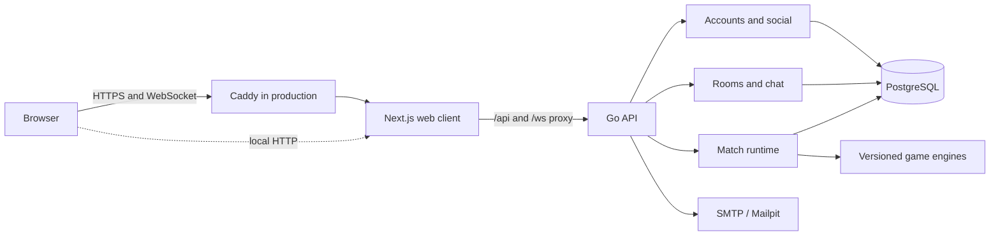

# CardPlay

**A private card table for friends, built for live play and reliable reconnection.**

CardPlay lets players enter as guests or with verified accounts, choose a game, create a room, invite friends, and play together in a browser. The server owns the rules and every card movement. Matches are stored in PostgreSQL before moves are acknowledged, so refreshing a page or restarting the API does not discard an accepted move.

**Playable now:** Monopoly Deal and Trump. **Planned:** Cambio.

This is an active development project. The [release checklist](docs/11-release-checklist.md) tracks the checks still required for a public deployment.

## Quick start

From the repository root, you need Docker with `docker compose` and Node.js 24 for the one-time local configuration step:

```sh
node scripts/setup.mjs
docker compose up --build -d
docker compose ps
```

Open **http://localhost:3000** and choose **Play as guest** to start without an email address. The first build may take a few minutes. `scripts/setup.mjs` creates an ignored `.env` with random local secrets if one does not already exist; it never replaces an existing file. Compose starts PostgreSQL and Mailpit, applies migrations, then starts the API and web client.

| Local service | Address                      | Purpose                                        |
| ------------- | ---------------------------- | ---------------------------------------------- |
| Web app       | http://localhost:3000        | Play in the browser                            |
| API readiness | http://localhost:8080/readyz | Database, migration, and notification health   |
| Mailpit       | http://localhost:8025        | Local verification and password-reset messages |
| PostgreSQL    | `127.0.0.1:55432`            | Local database                                 |

To create optional verified demo accounts:

```sh
docker compose --profile tools run --rm seed
```

The accounts are `alice@cardplay.test`, `bob@cardplay.test`, and `carol@cardplay.test`. Their password is the generated `SEED_PASSWORD` in your local `.env`. Keep that value out of commits, screenshots, and issues.

```sh
docker compose logs -f api web   # inspect the running app
docker compose down              # stop it; keep the PostgreSQL volume
```

The local Compose ports bind to loopback only. `docker compose down` retains the named database volume; `down --volumes` would remove its data.

## Games and player experience

| Game                                            | Players         | Current experience                                                                                                                                                                                                                                                                     |
| ----------------------------------------------- | --------------- | -------------------------------------------------------------------------------------------------------------------------------------------------------------------------------------------------------------------------------------------------------------------------------------- |
| [Monopoly Deal](docs/02-monopoly-deal-rules.md) | 2–5             | US 01723 rules, a 106-card deck, private hands, property sets, rent, action cards, payments, Just Say No response chains, and a win on three different complete sets.                                                                                                                  |
| [Trump](docs/13-trump-specification.md)         | 4, in two teams | A toss decides which team chooses the first trump suit. Either teammate may choose or pass the choice once to their partner. Players follow suit when able; the first team to seven tricks wins a round. Teammates sit opposite, and the winning team chooses trump in the next round. |
| Cambio                                          | Planned         | Shown as coming later; no playable engine is registered.                                                                                                                                                                                                                               |

Players can create private rooms or join through expiring invitation links. Hosts manage the lobby, and everyone must be ready before a match starts. Trump hosts can rename teams and move or swap players between teams before play. Rooms, invitations, chat, and matches are temporary and are removed when the last member leaves; inactive rooms are also cleaned up automatically.

Verified accounts support friends, blocks, invitations, password recovery, and session management. Guests need only a name and can create rooms, play, and chat, but cannot use friend features. Room chat is plain text and member-only; Trump closes it while the suit is being chosen.

The interface supports desktop and phone layouts, keyboard and tap controls, private card views, visible turn and connection state, and reconnection to the same seat. A second tab or device can take control of a seat; the old controller is disconnected. [The multiplayer design](docs/09-multiplayer-and-recovery.md) explains pauses, abandonment, and recovery in detail.

## Technology stack

| Layer           | Technology                                      | Role                                                      |
| --------------- | ----------------------------------------------- | --------------------------------------------------------- |
| Web             | Next.js 16.3.6, React 19.3.0, TypeScript 6, CSS | Responsive interface, same-origin `/api` and `/ws` proxy  |
| API             | Go 1.27.1, `chi` v5                             | HTTP routes, authentication, rooms, chat, match lifecycle |
| Realtime        | `coder/websocket`, PostgreSQL `LISTEN/NOTIFY`   | Live commands, presence, and per-player updates           |
| Database        | PostgreSQL 18.6, `pgx` v5, `sqlc` 1.31.1        | Durable state, transactions, typed SQL access             |
| Email           | SMTP; Mailpit locally                           | Verification and password recovery                        |
| Local runtime   | Docker Compose                                  | Reproducible database, API, web, and mail services        |
| Production edge | Caddy 2                                         | HTTPS and one public origin                               |
| Testing         | Go tests, Playwright, GitHub Actions            | Rules, integration, browser flows, and CI checks          |

Application dependencies are recorded in `go.mod`, `go.sum`, and `web/package-lock.json`; the Go and Node build images use fixed versions.

## Architecture

CardPlay is a modular Go server with a separate Next.js client. The browser uses one origin: Next.js serves the UI and forwards `/api/*` and `/ws` to the Go API. In production, Caddy terminates TLS and sends traffic to Next.js; the API and PostgreSQL stay on the private Compose network.



The main modules are:

- `internal/accounts` and `internal/social`: guests, verified accounts, sessions, friends, blocks, and invitations.
- `internal/rooms` and `internal/chat`: private room membership, host controls, team seating, presence, and member-only messages.
- `internal/matches` and `internal/realtime`: match lifecycle, serialized commands, WebSocket subscriptions, controller ownership, and state delivery.
- `internal/game`: the contract shared by rule engines. `internal/game/monopoly` and `internal/game/trump` implement their rules independently of HTTP and SQL.
- `internal/store` and `db`: `sqlc`-generated query code and embedded, checksummed migrations.
- `internal/obs`: structured logs, health checks, and Prometheus-format metrics.

### How a move becomes durable

1. A client sends a game command with a unique ID and the state revision it saw.
2. The match runtime locks the match row, checks the seat controller and revision, then asks the selected game engine to validate and apply the move.
3. The new snapshot, events, command result, and outbox notification commit together in PostgreSQL. Only then does the client receive an acknowledgement.
4. Connected players receive fresh views built for their own seats. Other hands, the draw order, and shuffle seed stay on the server.

A retry with the same command ID returns its recorded result instead of applying the move twice. PostgreSQL row locks give commands one order even with multiple API instances. `LISTEN/NOTIFY` wakes connected instances after a commit; missed notifications are safe because reconnecting clients reload the durable snapshot. [The command and WebSocket contract](docs/06-api-and-architecture.md) and [recovery guide](docs/09-multiplayer-and-recovery.md) cover the details.

Each room and match pins a `game_id` and `rules_version`. A game module provides setup, validation, command application, and a public/private view. Optional interfaces supply a public card catalog, an idle-turn policy, or a game-specific chat gate. Monopoly Deal uses a default move after the configured turn timeout; Trump currently waits for a connected player's decision. Matches pause when a seat disconnects.

### Data and security boundaries

PostgreSQL stores accounts, rooms, chat, match snapshots, command IDs, events, and the outbox. No acknowledged match state depends on API process memory. Session cookies are random and `HttpOnly`; the database stores hashes of their values. Mutating HTTP requests and WebSocket handshakes check the expected origin. Room and match reads check membership, and rule engines produce explicit per-player projections so private cards are never included in another player's view.

See [operations](docs/10-operations.md) for logs, readiness, metrics, backups, and restore procedures, and the [release checklist](docs/11-release-checklist.md) for the remaining production checks.

### API and realtime surface

| Interface                      | Examples                                              | Responsibility                      |
| ------------------------------ | ----------------------------------------------------- | ----------------------------------- |
| `GET /api/v1/games`            | Available games and rule versions                     | Public game catalog                 |
| `/api/v1/auth/*`, `/api/v1/me` | Guest entry, registration, sign-in, recovery, profile | Identity and sessions               |
| `/api/v1/rooms/*`              | Create, join, invite, ready, change seats             | Private room lifecycle              |
| `/api/v1/matches/*`            | Start, fetch own state, leave, vote to abandon        | Match lifecycle and resync          |
| `GET /ws`                      | `room.subscribe`, `match.subscribe`, `game.command`   | Live room updates and durable moves |
| `GET /healthz`, `GET /readyz`  | Liveness and dependency checks                        | Operations                          |

The main match tables are `matches` (status and revision), `match_participants` (seats and controllers), `game_snapshots` (server-only rules state), `game_events` (public and private events), `game_commands` (idempotent results), and `outbox` (committed update signals). The [API reference](docs/06-api-and-architecture.md) lists the complete route and WebSocket contracts.

## Repository layout

```text
.
├── cmd/cardplay/          Go CLI: serve, migrate, seed, health
├── internal/
│   ├── game/              Versioned game interface and rule engines
│   ├── matches/           Durable command and match runtime
│   ├── realtime/          WebSocket hub and live updates
│   ├── accounts/          Authentication and email
│   ├── social/            Friends, blocks, and mutes
│   ├── rooms/             Room, host, and team controls
│   ├── chat/              Member-only room chat
│   └── store/             Generated typed SQL queries
├── db/                    SQL migrations and queries
├── web/                   Next.js application
├── scripts/               Setup, end-to-end tests, load test, operations
├── deploy/                Caddy and database TLS helpers
├── docs/                  Rules, architecture, operations, release notes
├── compose.yaml           Local stack
└── compose.prod.yaml      Single-host production stack
```

## Development without containerizing the app

Install Go 1.27.1 and Node.js 24.16.0. Start PostgreSQL and Mailpit in Docker, then run the API and web client in separate terminals. The API commands below run from the repository root:

```sh
node scripts/setup.mjs
docker compose up -d db mail
node scripts/run.mjs go run ./cmd/cardplay migrate
node scripts/run.mjs go run ./cmd/cardplay serve
```

In another terminal:

```sh
cd web
npm ci
npm run dev
```

`scripts/run.mjs` loads the ignored root `.env` without printing its values. To populate the optional demo users, run `node scripts/run.mjs go run ./cmd/cardplay seed` from the repository root. If the API address changes, set `API_INTERNAL_URL` for the Next.js process to an address it can reach, then restart or rebuild the web client.

## Configuration

Use `node scripts/setup.mjs` locally. `.env.example` documents development settings, while `.env.prod.example` is the template for `compose.prod.yaml`. Keep populated environment files and generated database certificates out of Git.

| Setting                                                   | Purpose                                                               |
| --------------------------------------------------------- | --------------------------------------------------------------------- |
| `APP_ORIGIN`                                              | Exact browser origin allowed to make writes and open sockets          |
| `DATABASE_URL`                                            | PostgreSQL connection for the Go API and migrations                   |
| `POSTGRES_USER`, `POSTGRES_DB`, `POSTGRES_PASSWORD`       | Local or production Compose database                                  |
| `SMTP_ADDR`, `MAIL_FROM`                                  | Outgoing verification and reset mail; Mailpit supplies local SMTP     |
| `SMTP_USERNAME`, `SMTP_PASSWORD`                          | Authenticated SMTP in production                                      |
| `SEED_PASSWORD`                                           | Local demo-account password; never publish its value                  |
| `API_INTERNAL_URL`                                        | API address baked into the Next.js rewrites at build time             |
| `MATCH_TURN_TIMEOUT`                                      | Monopoly Deal idle-turn limit; `2m` by default, `0` to disable        |
| `LOG_FORMAT`, `LOG_LEVEL`, `METRICS_ADDR`, `DB_MAX_CONNS` | Optional operations settings; see [operations](docs/10-operations.md) |

Production also requires `SITE_ADDRESS` and `ACME_EMAIL` for Caddy, an HTTPS `APP_ORIGIN`, verified PostgreSQL TLS, and authenticated SMTP. Follow the [deployment guide](docs/12-deployment.md) rather than using the development Compose file on a public host.

## Testing and checks

From the repository root:

```sh
node scripts/run.mjs go test ./cmd/... ./internal/... ./db/...
node scripts/run.mjs go vet ./cmd/... ./internal/... ./db/...
node scripts/run.mjs go build ./cmd/cardplay
```

From `web/`:

```sh
npm ci
npm run format:check
npm run typecheck
npm run lint
npm run build
```

Go database integration tests require `TEST_DATABASE_URL` to point to a **separate test database**, never the database used for play. CI provisions one and runs the Go suite with the race detector. The [Playwright guide](scripts/e2e/README.md) explains how to run real multi-browser flows against a disposable database; `scripts/e2e/tests/trump.spec.ts` covers a complete four-player Trump round. `scripts/loadtest` contains the WebSocket load generator. After changing SQL queries, regenerate `internal/store` with:

```sh
docker compose --profile tools run --rm sqlc
```

GitHub Actions runs Go tests and static checks, validates generated SQL, checks the frontend, and runs the browser suite. The [release checklist](docs/11-release-checklist.md) records checks that still depend on the real deployment environment.

## Documentation

| Topic                          | Document                                                                                                                |
| ------------------------------ | ----------------------------------------------------------------------------------------------------------------------- |
| Product scope                  | [Product requirements](docs/01-product-requirements.md)                                                                 |
| Monopoly Deal rules            | [Rule specification](docs/02-monopoly-deal-rules.md) and [engine traceability](docs/08-monopoly-engine-traceability.md) |
| Trump rules and implementation | [Trump specification](docs/13-trump-specification.md)                                                                   |
| HTTP API and access model      | [API and architecture](docs/06-api-and-architecture.md)                                                                 |
| Durable play and reconnect     | [Multiplayer and recovery](docs/09-multiplayer-and-recovery.md)                                                         |
| Monitoring and backup          | [Operations](docs/10-operations.md)                                                                                     |
| Production setup               | [Deployment](docs/12-deployment.md)                                                                                     |
| Release requirements           | [Release checklist](docs/11-release-checklist.md)                                                                       |

## License and game assets

This repository does not currently include a project `LICENSE` file. Publishing the repository on GitHub does not by itself grant others permission to reuse its code or assets. The tracked `docs/evidence` directory contains third-party research material; review it before making the repository public. See the [asset and license inventory](docs/04-assets-and-licenses.md) and complete the branding, notices, and production checks in the [release checklist](docs/11-release-checklist.md) before a public game launch.
